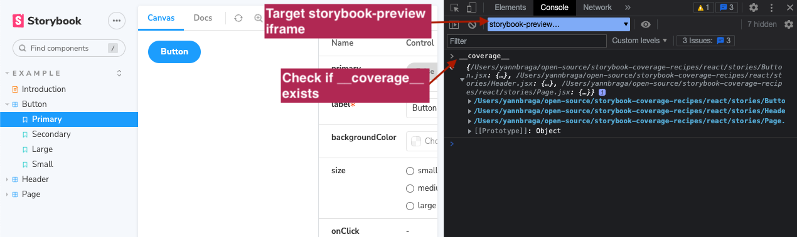
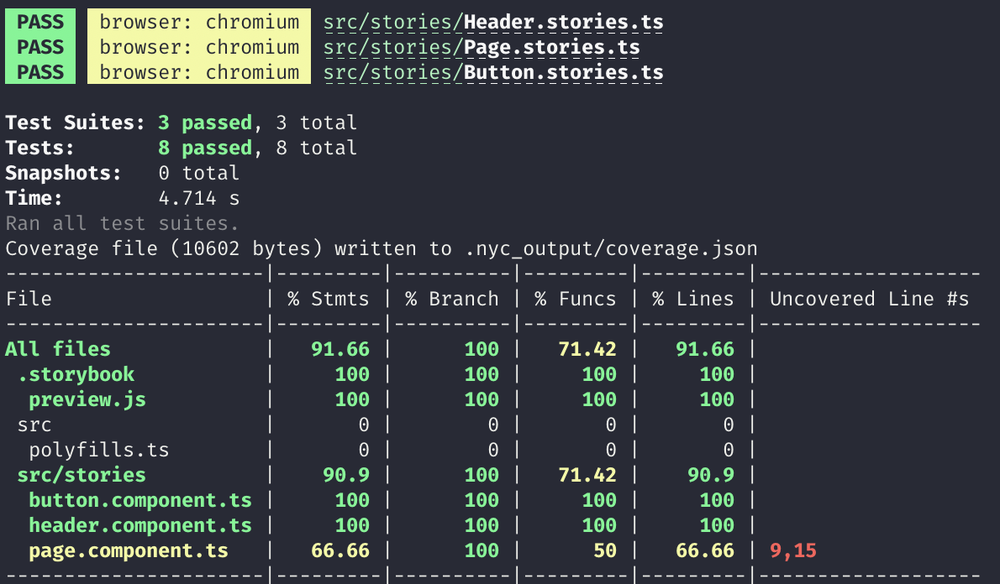

# Angular

## Setting up coverage

Install `istanbul-instrumenter-loader` and register it as part of Storybook's webpack config:

```js
// .storybook/main.js
module.exports = {
  webpackFinal: async (config) => {
    const rules = config.module?.rules || [];
    rules.push(
      {
        test: /\.(js|ts)$/,
        loader: 'istanbul-instrumenter-loader',
        options: { esModules: true },
        enforce: 'post',
        include: require('path').join(__dirname, '..', 'src'),
        exclude: [
          /\.(e2e|spec|stories)\.ts$/,
          /node_modules/,
          /polyfills\.ts/,
          /preview\.js/,
          /(ngfactory|ngstyle)\.js/,
        ],
      });

    config.module = config.module || {};
    config.module.rules = rules;

    return config;
  }
}
```

Once you've done that, you should check whether the instrumentation is happening correctly. To do so:

1. Open your Storybook
2. Open developer tools
3. Select the `storybook-preview-iframe` as a target
4. Type `__coverage__` and see if it evaluates to an object containing information about your components. If it does, then you're good to go!



## Generating coverage

You will need to have the `@storybook/test-runner` installed. After that, just run the following command:

```sh
yarn test-storybook --coverage
```

