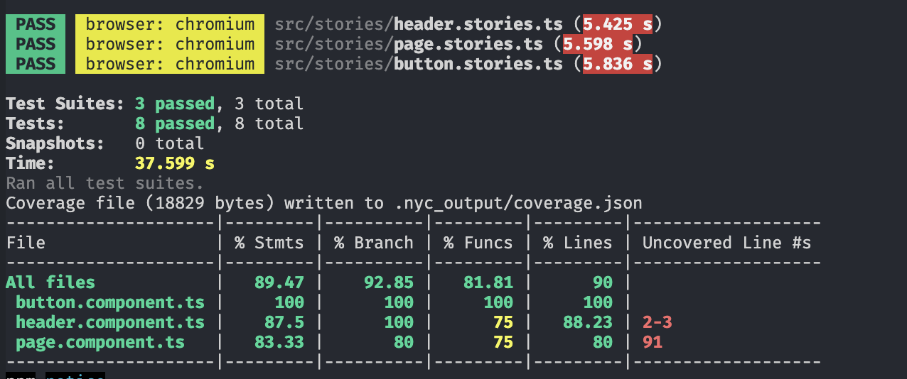

# Agular + Vite

- [Open in stackblitz](https://stackblitz.com/github/yannbf/storybook-coverage-recipes/tree/main/angular_vite?preset=node)

This project was generated with [Analog](https://npmjs.com/package/create-analog), and you can see the original template [here](https://github.com/brandonroberts/angular-analog-storybook-vite).

## Setting up coverage

Install the `@storybook/addon-coverage` addon and register it. That's it!

```js
// .storybook/main.js
module.exports = {
  addons: ["@storybook/addon-coverage"]
}
```

Once you've done that, you should check whether the instrumentation is happening correctly. When you run `start-storybook`, you should see a log in the terminal saying "Adding istanbul plugin to vite config".

## Generating coverage

You will need to have the `@storybook/test-runner` installed. The test runner visits a running Storybook, so you will have to run Storybook and after that, execute the test runner with the `--coverage` flag enabled:

```sh
yarn storybook
```
then

```sh
yarn test-storybook --coverage
```

As a result, you should see the report in the CLI:



If you want to generate an interactive reporter, you can then run:

```sh
npx nyc report --reporter html coverage/storybook --report-dir coverage/storybook
```

And open the `index.html` file inside of the `coverage/storybook` folder.