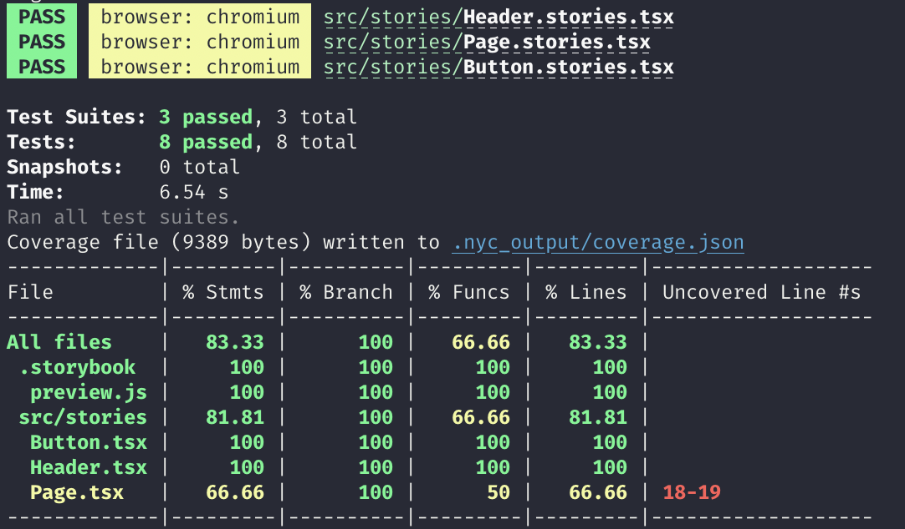

# CRA typescript

## Setting up coverage

Install the `@storybook/addon-coverage` addon and register it. That's it!

```js
// .storybook/main.js
module.exports = {
  addons: ["@storybook/addon-coverage"]
}
```

Once you've done that, you should check whether the instrumentation is happening correctly. To do so:

1. Open your Storybook
2. Open developer tools
3. Select the `storybook-preview-iframe` as a target
4. Type `__coverage__` and see if it evaluates to an object containing information about your components. If it does, then you're good to go!


## Generating coverage

You will need to have the `@storybook/test-runner` installed. After that, just run the following command:

```sh
yarn test-storybook --coverage
```

