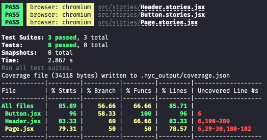

# react-vite

- [Open in stackblitz](https://stackblitz.com/github/yannbf/storybook-coverage-recipes/tree/main/react_vite?preset=node)

### Bug

Because of this line of code in nyc: https://github.com/istanbuljs/nyc/blob/ab7c53b2f340b458789a746dff2abd3e2e4790c3/index.js#L433
If that line of code is commented out, then it works correctly. My feeling is that sourcemaps are not working properly in React + Storybook. 

## Setting up coverage

Install `vite-plugin-istanbul` and register it in your `.storybook/main.js` file.
Optionally, use defaults from `@storybook/addon-coverage/dist/cjs/constants` so you can exclude files.

```js
// .storybook/main.js
const istanbul = require('vite-plugin-istanbul');
// get default config from addon-coverage – no need to register it
const constants = require('@storybook/addon-coverage/dist/cjs/constants');

module.exports = {
  // ...
  async viteFinal(config) {
    config.plugins.push(istanbul({
      exclude: constants.defaultExclude,
      extension: constants.defaultExtensions
    }));
    // customize the Vite config here
    return config;
  },
}
```

## Generating coverage

You will need to have the `@storybook/test-runner` installed. After that, just run the following command:

```sh
yarn test-storybook --coverage
```

