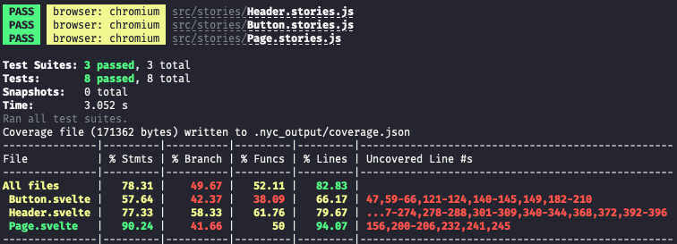
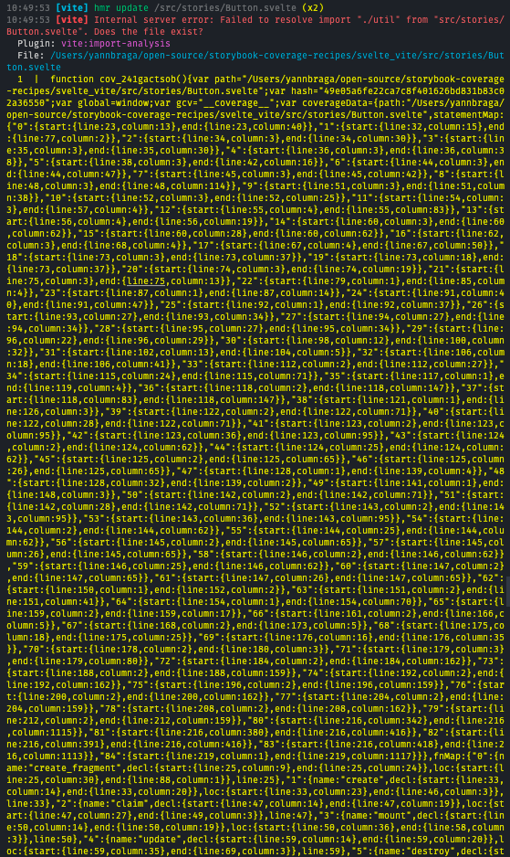

# Svelte + Vite

- [Open in stackblitz](https://stackblitz.com/github/yannbf/storybook-coverage-recipes/tree/main/svelte_vite?preset=node)

## Setting up coverage

Install `vite-plugin-istanbul` and register it in your `.storybook/main.js` file.
Optionally, use defaults from `@storybook/addon-coverage/dist/cjs/constants` so you can exclude files.

```js
// .storybook/main.js
const istanbul = require('vite-plugin-istanbul');
// get default config from addon-coverage – no need to register it
const constants = require('@storybook/addon-coverage/dist/cjs/constants');

module.exports = {
  // ...
  async viteFinal(config) {
    // enable sourcemaps for istanbul
    config.build ||= {};
    config.build.sourcemap = true;
    config.plugins.push(istanbul({
      exclude: constants.defaultExclude,
      extension: constants.defaultExtensions
    }));
    // customize the Vite config here
    return config;
  },
}
```

Alternative syntax using `mergeConfig` from vite:

```js
// .storybook/main.js
const { mergeConfig } = require('vite');
const istanbul = require('vite-plugin-istanbul');
// get default config from addon-coverage – no need to register it
const constants = require('@storybook/addon-coverage/dist/cjs/constants');

module.exports = {
  // ...
  async viteFinal(config) {
    return mergeConfig(config, {
      // customize the Vite config here
      build: {
        sourcemap: true
      },
      plugins: [
        istanbul({
          exclude: constants.defaultExclude,
          extension: constants.defaultExtensions
        })
      ]
    });
  },
}
```

Once you've done that, you should check whether the instrumentation is happening correctly. To do so:

1 - Open your Storybook
2 - Open developer tools
3 - Select the `storybook-preview-iframe` as a target
4 - Type `__coverage__` and see if it evaluates to an object containing information about your components. If it does, then you're good to go!


### Setup nycrc.json

Because svelte uses a different file extension, you need to setup a `nycrc.json` file to tell nyc to consider svelte files:

```json
{
  "extension": [".svelte"]
}
```

## Generating coverage

You will need to have the `@storybook/test-runner` installed. After that, just run the following command:

```sh
yarn test-storybook --coverage
```



### Caveat

If there's an error reported in the CLI, there is a lot of noise in the output:

