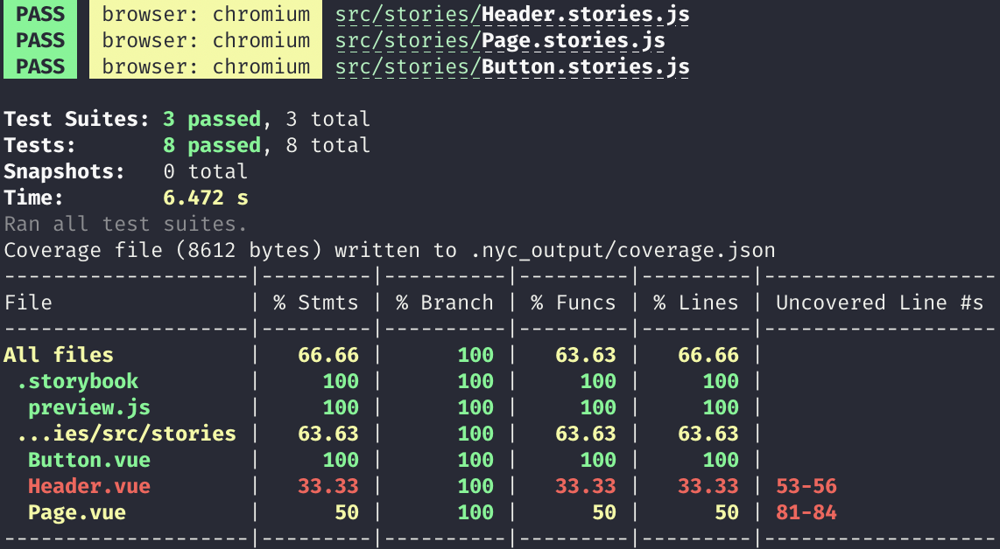

# Vue + Webpack

- [Open in stackblitz](https://stackblitz.com/github/yannbf/storybook-coverage-recipes/tree/main/vue?preset=node)

### Bug

For some reason, the generated `storybook-coverage.json` file contains wrong paths. Notice the `src/stories/src/stories/` path there:

```json
{
  "storybook-coverage-recipes/vue/src/stories/src/stories/Button.vue": {
    "path": "storybook-coverage-recipes/vue/src/stories/src/stories/Button.vue",
    "statementMap": { }
  }
}
```

In the [vue3](../vue3) example, this issue does not occur. Any help figuring out why this is happening or a possible fix is appreciated.

## Setting up coverage

Install the `@storybook/addon-coverage` addon and register it.

```js
// .storybook/main.js
module.exports = {
  addons: ["@storybook/addon-coverage"]
}
```

Once you've done that, you should check whether the instrumentation is happening correctly. When you run `start-storybook`, you should see a log in the terminal saying "Adding istanbul plugin to babel config".

### Setup nycrc.json

Because vue uses a different file extension, you need to setup a `.nycrc.json` file to tell nyc to consider vue files, alongside other extensions you want to be included:

```json
{
  "extension": [".vue", ".js", "jsx", ".ts", "tsx"]
}
```

## Generating coverage

You will need to have the `@storybook/test-runner` installed. The test runner visits a running Storybook, so you will have to run Storybook and after that, execute the test runner with the `--coverage` flag enabled:

```sh
yarn storybook
```
then

```sh
yarn test-storybook --coverage
```

As a result, you should see the report in the CLI:


