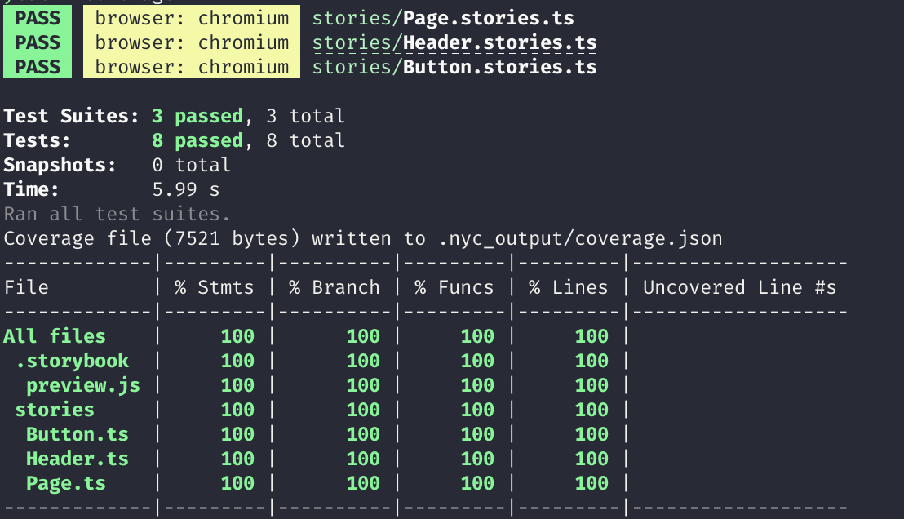

# web_components_typescript

- [Open in stackblitz](https://stackblitz.com/github/yannbf/storybook-coverage-recipes/tree/main/web_components_typescript?preset=node)

## Setting up coverage

Install the `@storybook/addon-coverage` addon and register it. That's it!

```js
// .storybook/main.js
module.exports = {
  addons: ["@storybook/addon-coverage"]
}
```

## Generating coverage

You will need to have the `@storybook/test-runner` installed. After that, just run the following command:

```sh
yarn test-storybook --coverage
```


